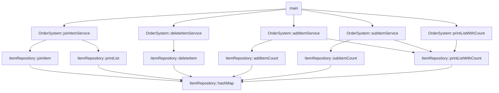

# pair-orderProgram-sh
==========================

### Flow chart

```mermaid
graph TD;
    main(main)-->OrderSystem::joinItemService[OrderSystem::joinItemService];
    main(main)-->OrderSystem::deleteItemService[OrderSystem::deleteItemService];
    main(main)-->OrderSystem::addItemService[OrderSystem::addItemService];
    main(main)-->OrderSystem::printListWithCount[OrderSystem::printListWithCount];
    main(main)-->OrderSystem::subItemService[OrderSystem::subItemService];
    OrderSystem::joinItemService[OrderSystem::joinItemService]-->ItemRepository::joinItem[ItemRepository::joinItem];
    OrderSystem::joinItemService[OrderSystem::joinItemService]-->ItemRepository::printList[ItemRepository::printList];
    OrderSystem::deleteItemService[OrderSystem::deleteItemService]-->ItemRepository::deleteItem[ItemRepository::deleteItem];
    OrderSystem::addItemService[OrderSystem::addItemService]-->ItemRepository::addItemCount[ItemRepository::addItemCount];
    OrderSystem::subItemService[OrderSystem::subItemService]-->ItemRepository::subItemCount[ItemRepository::subItemCount];
    OrderSystem::addItemService[OrderSystem::addItemService]-->ItemRepository::printListWithCount[ItemRepository::printListWithCount];
    OrderSystem::subItemService[OrderSystem::subItemService]-->ItemRepository::printListWithCount[ItemRepository::printListWithCount];
    OrderSystem::printListWithCount[OrderSystem::printListWithCount]-->ItemRepository::printListWithCount[ItemRepository::printListWithCount];
    ItemRepository::joinItem[ItemRepository::joinItem]-->ItemRepository::hashMap[ItemRepository::hashMap];
    ItemRepository::printList[ItemRepository::printList]-->ItemRepository::hashMap[ItemRepository::hashMap];
    ItemRepository::deleteItem[ItemRepository::deleteItem]-->ItemRepository::hashMap[ItemRepository::hashMap];
    ItemRepository::addItemCount[ItemRepository::addItemCount]-->ItemRepository::hashMap[ItemRepository::hashMap];
    ItemRepository::subItemCount[ItemRepository::subItemCount]-->ItemRepository::hashMap[ItemRepository::hashMap];
    ItemRepository::printListWithCount[ItemRepository::printListWithCount]-->ItemRepository::hashMap[ItemRepository::hashMap];
```
---

